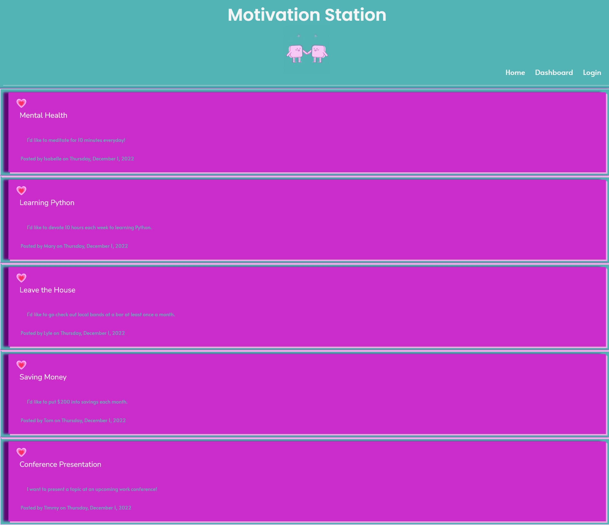
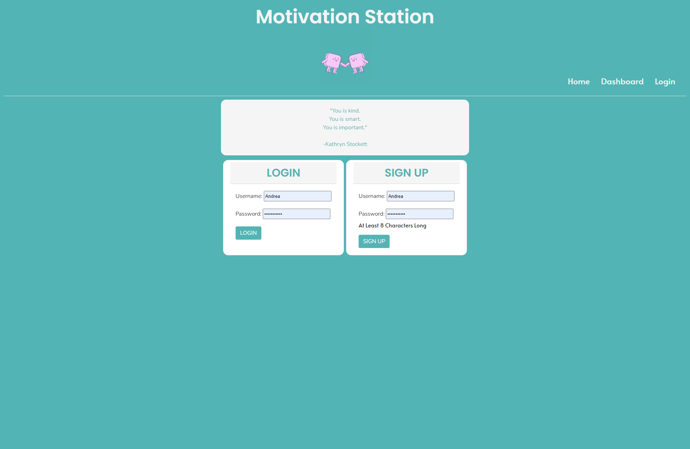
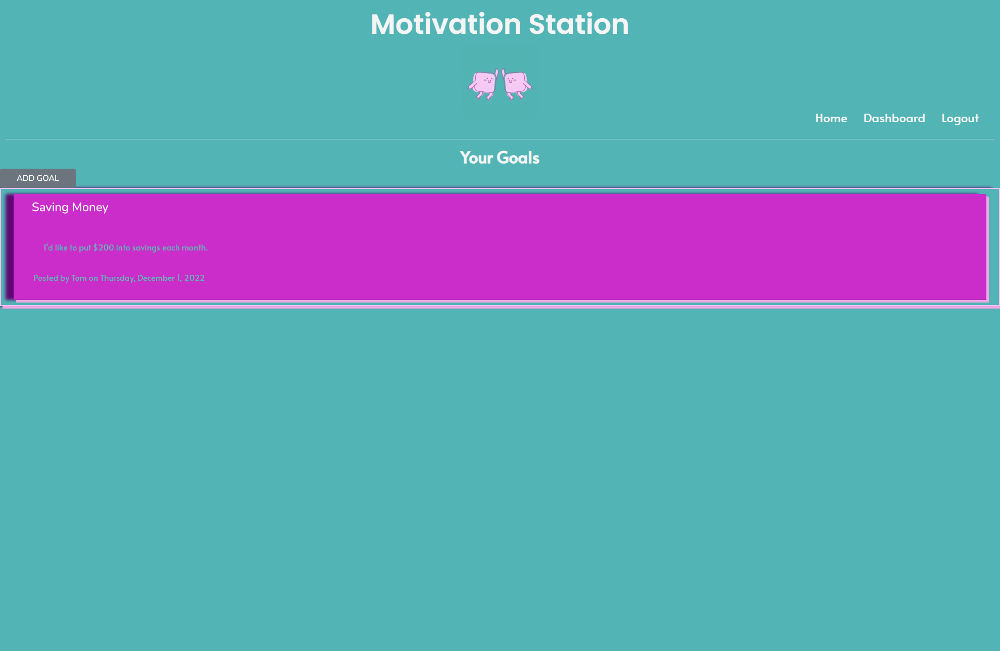
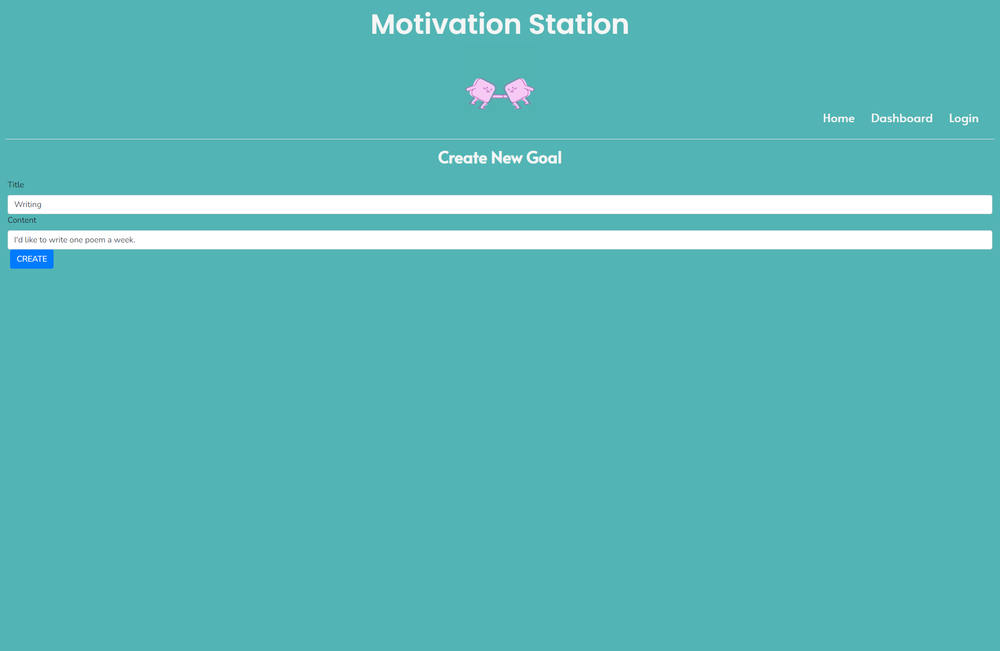
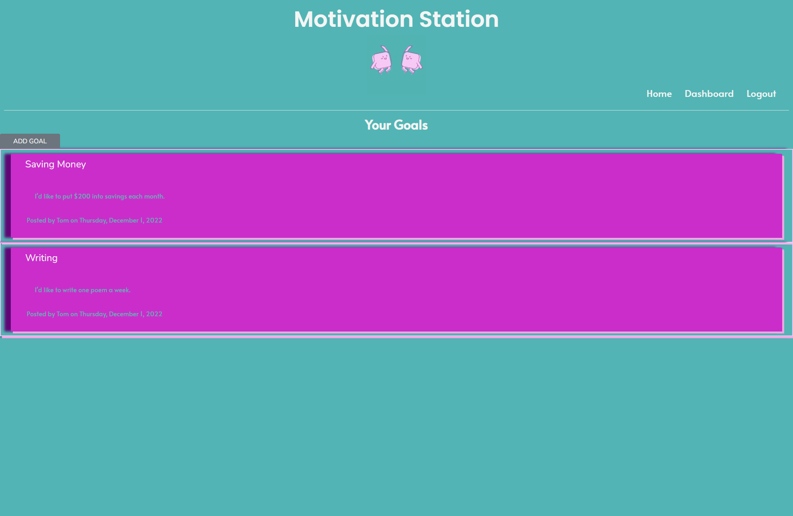
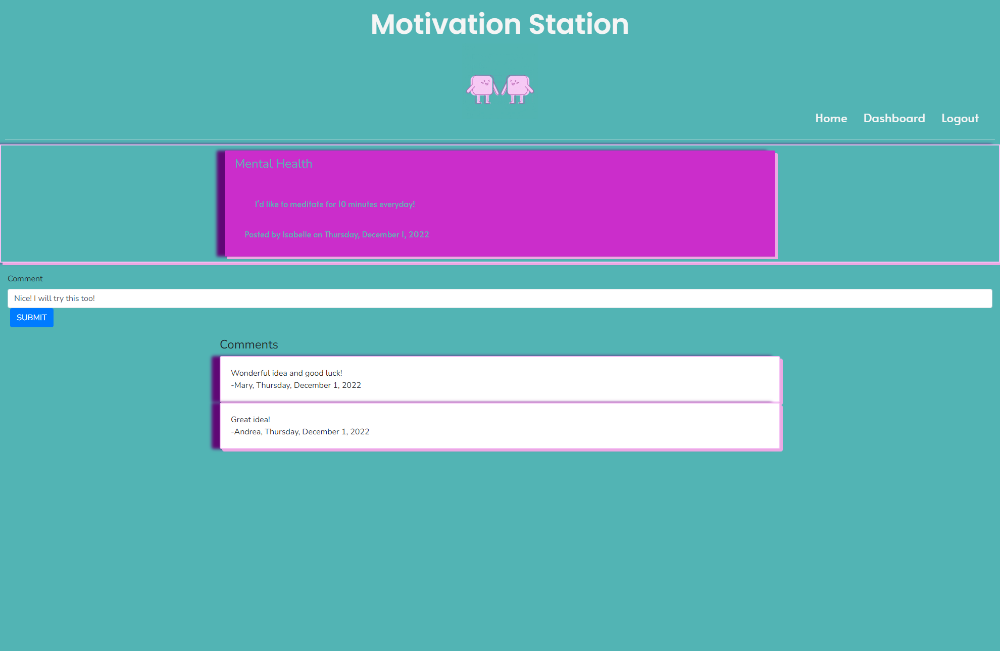
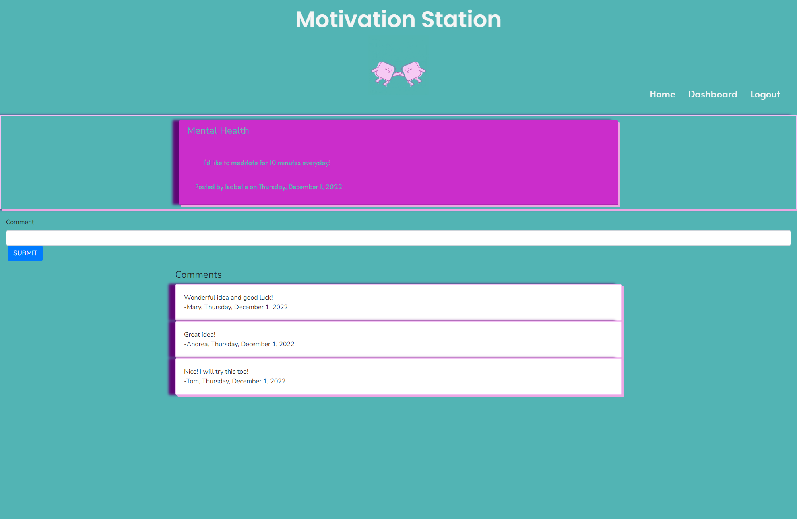
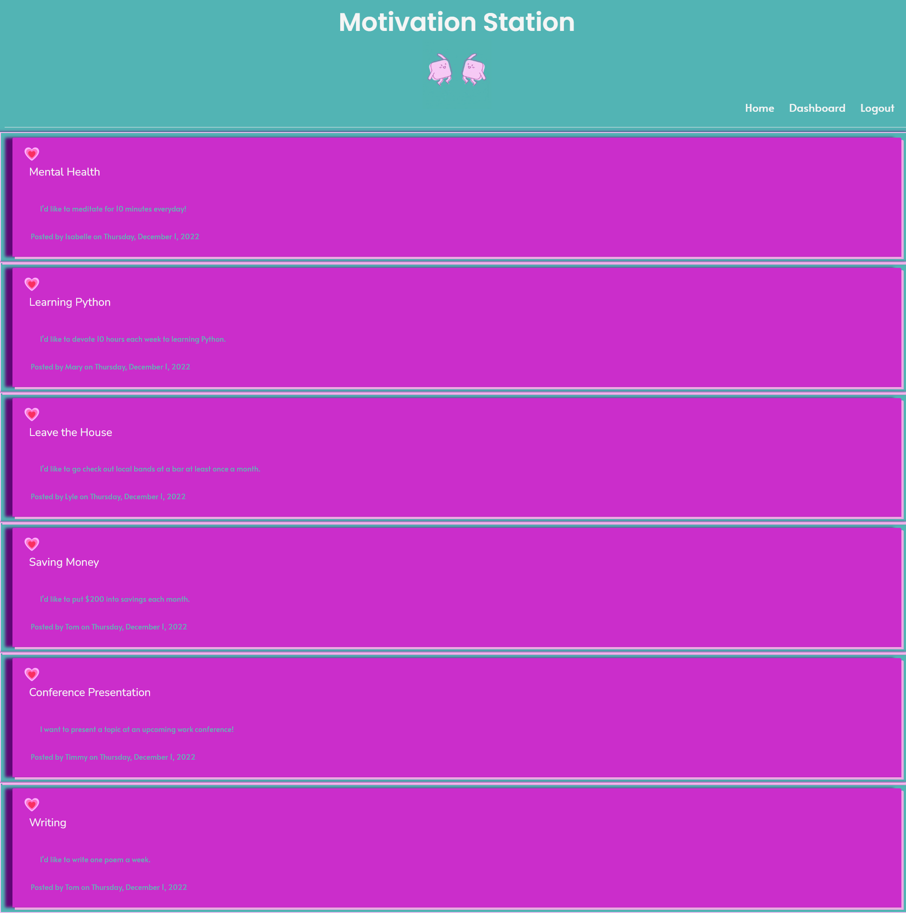

# Motivation Station

## Licensing:

## Table of Contents 
- [Description](#description)
- [Technology](#technology)
- [User Story](#user)
- [Installation](#installation)
- [Usage](#usage)
- [License](#license)
- [Contributing](#contributing)
- [Tests](#tests)
- [Questions](#questions)

## Description:
This is our group project for Project 2 created in the UW Coding Bootcamp. On the front-end, the app can be accessed at Heroku.  On the back-end, this is a node command line application that utilizes sequilize, dotenv, mysql2, express, handlebars, dayjs, and bcrypt.  The Motivation Station is an app where users can keep track of their goals.  They are able to create an account and post their goals.  They are also able to comment on other user’s goals.  

## User Story 
	As a… person who has a number of life goals
	I want to… be able to access an app to keep track of my goals, look at other people’s goals on the app, and be able to comment on other’s goals
	So that… I can stay motivated to keep my goals

## Technology Used:
- Heroku
- Github
- Sequilize
- Dotenv
- Mysql2
- Express
- Handlebars
- Dayjs
- Bcrypt

## Installation:
- Download it through Github
- Ensure express is installed
- Ensure express-handlebars is installed
- Ensure express-session is installed
- Ensure mysql2 is installed
- Ensure sequelize is installed
- Ensure connect-session-sequelize is installed
- Ensure dotenv is installed
- Ensure bcrypt is installed
- Ensure dayjs is installed
- To connect to the database, once files are downloaded to you computer, you will need to use a .env file to input your password and username for your mysql.

## Usage:

Webpage: https://secret-springs-16165.herokuapp.com/

Back-end after cloning or downloading repo files:
- Open terminal and navigate to motivation_station folder
- Type npm init -y into terminal to create a new .json file
- Type npm i into terminal
- Type npm i express into terminal
- Type npm i express-handlebars into terminal
- Type npm i express-session into terminal
- Type npm i mysql2 into terminal
- Type npm i sequelize into terminal
- Type npm i dotenv into terminal
- Type npm i bcrypt into terminal
- Type npm i connect-session-sequelize into terminal
- Type npm i dayjs into terminal
- Navigate to the db folder
- Type mysql -u root -p into terminal
- Enter your password into terminal
- Type source schema.sql into terminal
- Type quit into terminal
- Navigate back to the motivation_station in terminal
- Type node seeds/index.js so the seeds will populate the database
- Type npm start into the terminal
- You will see the Now Listening indication and can access on your localhost

Screenshots:

Homepage

Login and Sign Up Page

Dashboard Once Logged In

Adding a Goal

New Goal Shows up on your Dashboard

Adding a Comment to a Goal from Another User

User's Comment Added

New Goal Shows up on Homepage

## License:
MIT

## Contributing:
Group Members:
Andrea Hergert,
Alli Dodt,
Tahlia Bolden,
Jairo Mariscal

## Tests:
None

## Questions:
- Github: [andreahergert](https://github.com/andreahergert)
- Email: ahergert24@hotmail.com 